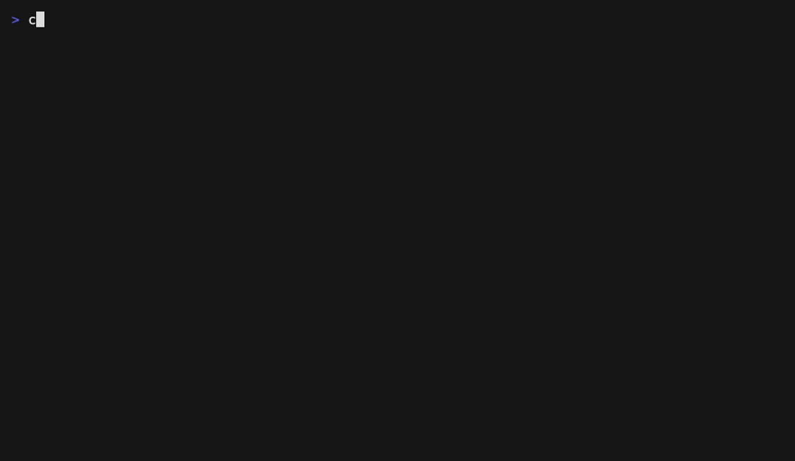

# Crosshair



**A quality gate for your MCP server's tool definitions.**

Your MCP server's tools are an API — but the consumer is a language model, not a programmer. The model only ever sees the tool names, descriptions, and parameter schemas you ship. If a parameter has no description, or two tools read alike, the model has to guess. Nothing in a normal test suite checks that surface.

Crosshair does. Point it at any MCP server and it inspects the tools the way the model sees them — first statically, then behaviorally.

## Five-second start

No config, no API key, no model calls:

```bash
npx crosshair lint -- npx -y @modelcontextprotocol/server-filesystem /tmp
```

```
schema-lint · 18 warnings
  ⚠ read_text_file [undescribed-param] parameter "path" has no description
  ⚠ write_file     [undescribed-param] parameter "content" has no description
  ⚠ search_files   [undescribed-param] parameter "pattern" has no description
  ...
```

That's a real result against a real, widely-used server. Try it on your own:

```bash
npx crosshair lint -- <the command that starts your server>
```

Everything after `--` is your server's launch command, passed through untouched.

## The problem

A model picks which tool to call, and with what arguments, based entirely on your tool definitions. Two failure modes follow, and neither shows up in unit tests:

- **The schema is thin.** Undescribed parameters, vague descriptions, near-identical tools. The model is guessing, and you can't see it.
- **A change quietly regresses selection.** You reword a description to be "clearer," and the model starts reaching for the wrong tool on inputs that used to work. Your handlers are unchanged and fully green; the behavior broke anyway.

Crosshair tests both — the static surface with `lint`, and the live behavior with sampled cases you can run in CI.

## Behavioral testing

Beyond linting, you can assert how a model *uses* your tools. Write cases in `crosshair.config.ts`:

```ts
import { defineConfig, expectTool, expectNoTool } from "@crosshair/core";

export default defineConfig({
  server: { command: "node", args: ["dist/server.js"] },
  cases: [
    {
      name: "order status lookup",
      prompt: "What's the status of order ORD-9001?",
      assertions: [expectTool("get_order_status", { args: { order_id: "ORD-9001" } })],
    },
    {
      name: "a thank-you must not trigger a destructive tool",
      prompt: "Thanks, that's all I needed!",
      assertions: [expectNoTool()],
    },
  ],
});
```

```bash
crosshair run    # needs an API key for your provider
```

```
crosshair  2 cases · claude-haiku-4-5
  ✓ order status lookup                              10/10 (need 8)
  ✗ a thank-you must not trigger a destructive tool   6/10 (need 8)
      4× expected no tool call, got cancel_order
2 passed, 1 failed
```

### Why the fractions

LLM tool selection is non-deterministic. A single run that passes proves nothing — the model might pick right 7 times in 10. So Crosshair runs each case multiple times and requires a pass *rate* to clear a threshold. A green check means *reliably* green, not lucky once. Responses are cached, so unchanged cases re-run instantly and cost nothing.

## In CI

`crosshair run` exits non-zero on failure and can emit JUnit XML, so a tool-selection regression fails the build like any other test:

```yaml
- name: Crosshair
  uses: mhandresen/crosshair/packages/action@v0
  env:
    ANTHROPIC_API_KEY: ${{ secrets.ANTHROPIC_API_KEY }}
```

Secrets are never exposed to pull requests from forks. See the CI guide for the fork-safe workflow.

## Assertions

- `expectTool(name, { args })` — the model called this tool, with arguments matching the given subset
- `expectOneOf(...names)` — it called any one of these acceptable tools
- `expectNoTool()` — it correctly called nothing

## What Crosshair is not

- **Not a replacement for your unit tests.** Those test your handler code; Crosshair tests the model-facing surface your handlers can't see.
- **Not a benchmark.** It doesn't rank models. It tests *your* server against the behavior *you* specify.
- **Not a runtime guard.** It runs in development and CI, not in your production request path.

## License

MIT